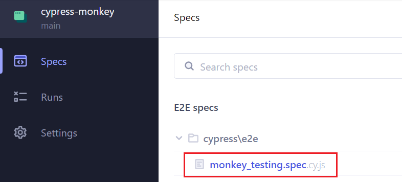
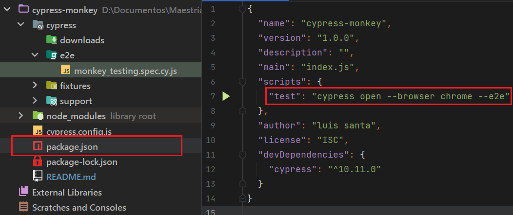
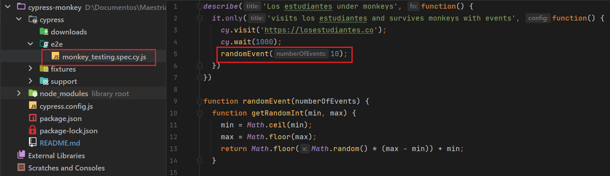

# cypress-monkey

## Intalación
Ejecutar el comando `npm i` para la instalación de las dependencias y paquetes necesarios.

## Correr
- Ejecutar el comando `npm run test` para iniciar los test.
- Se abrira automaticamente el navegador de chrome.
- Seleccionar el test a correr, en este caso el test llamado _**monkey_testing.spec.cy.js**_.

## Configuración
- En el archivo **_package.json_** se puede cambiar el navegador predeterminado (Chrome).

- En el archivo _**monkey_testing.spec.cy.js**_ se puede cambiar la cantidad de eventos predeterminados(10).

